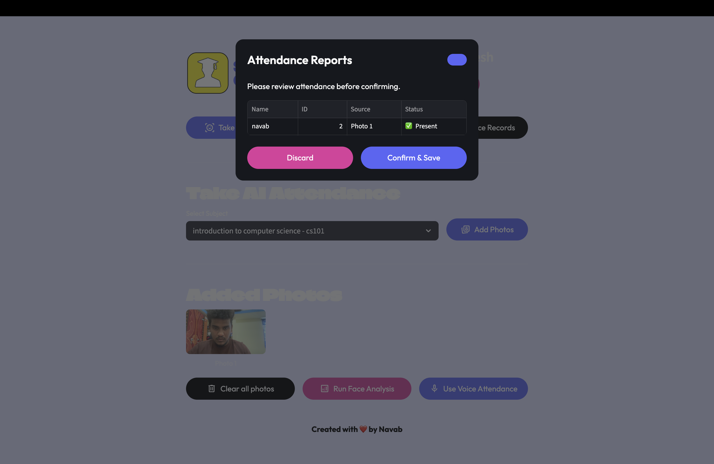
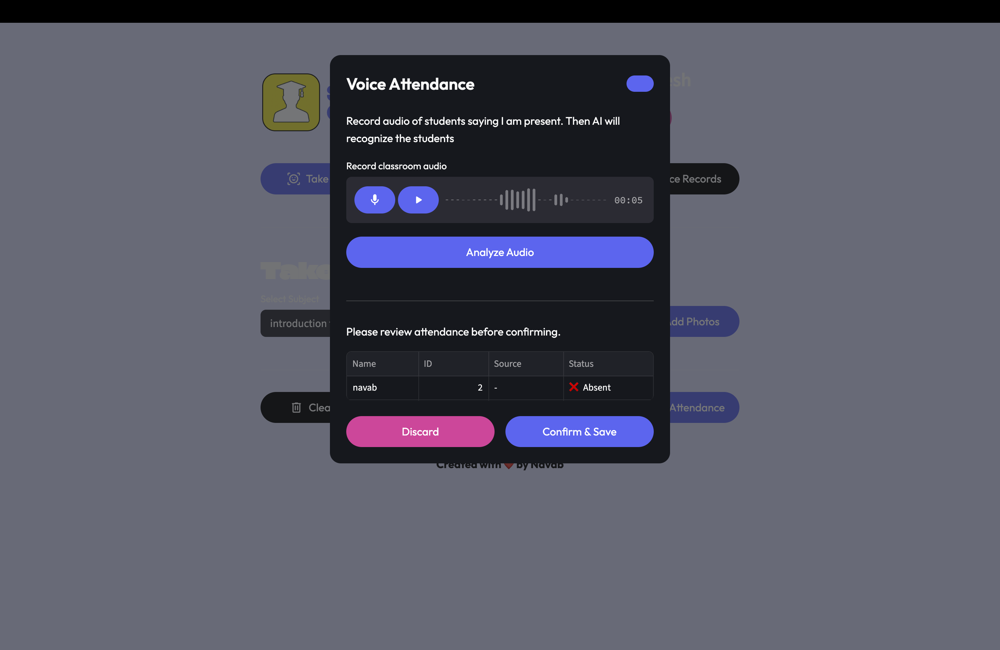
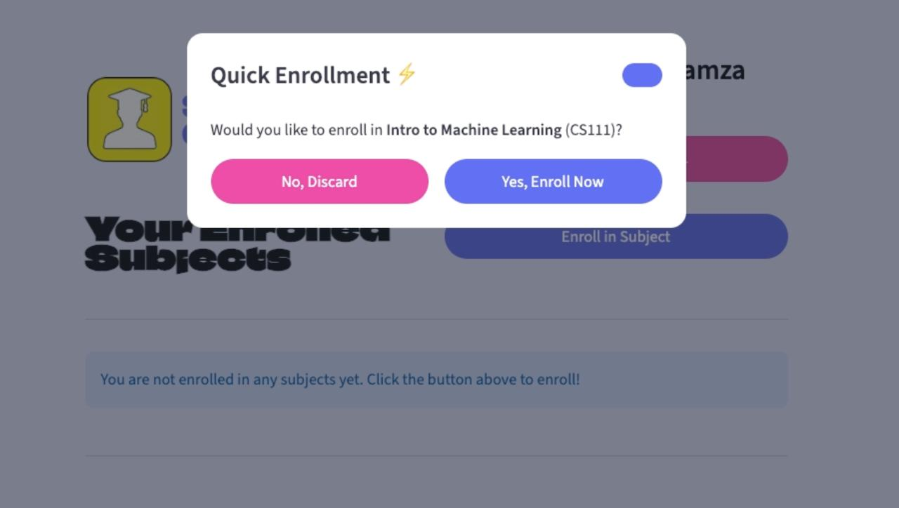
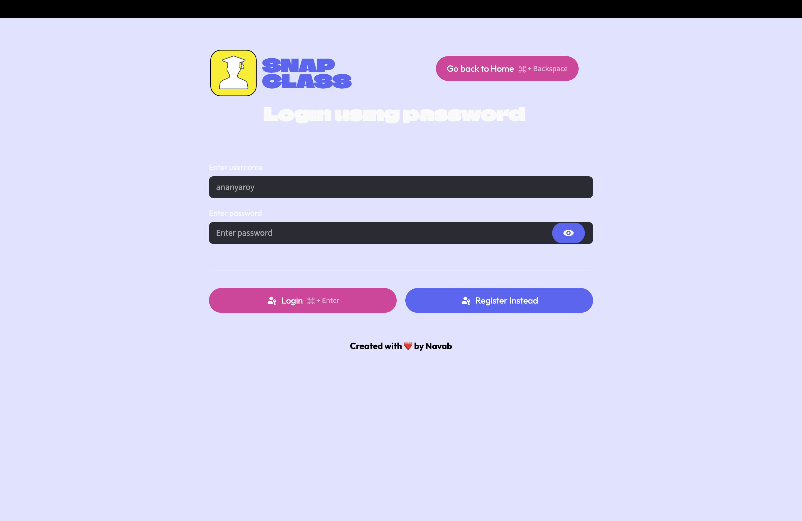
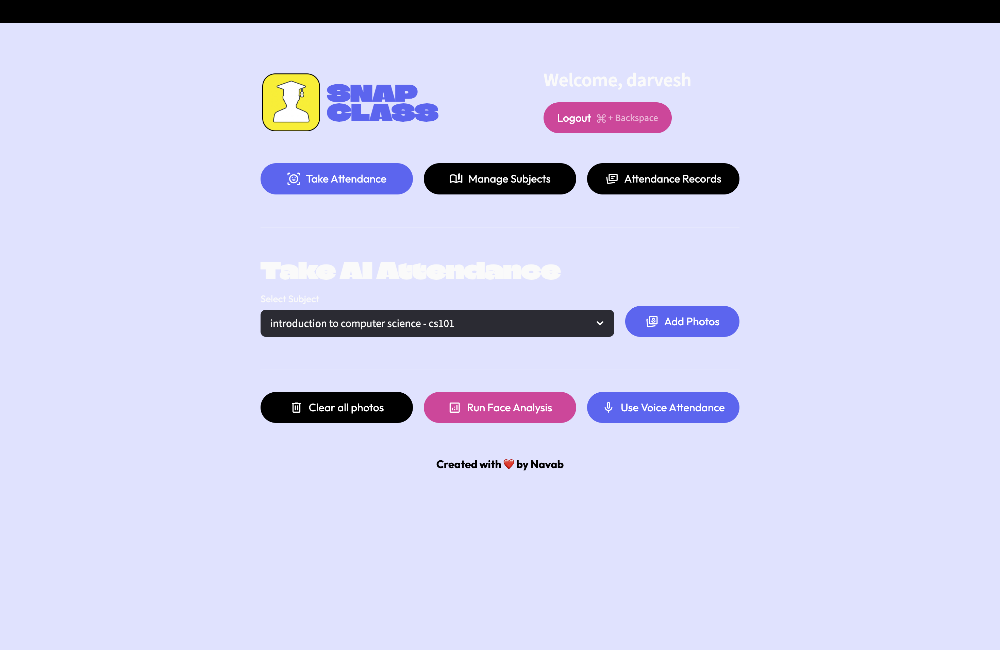
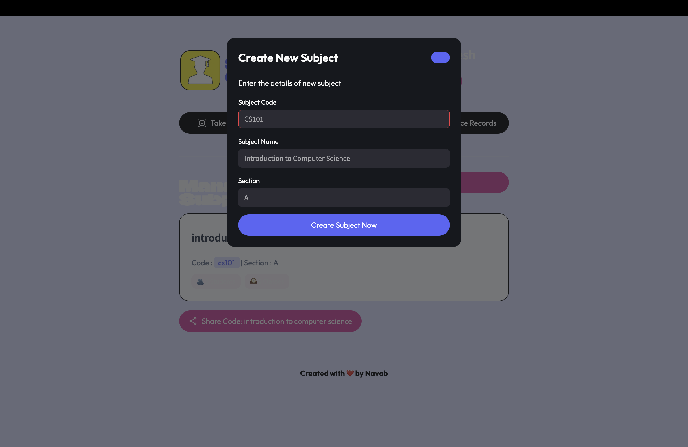
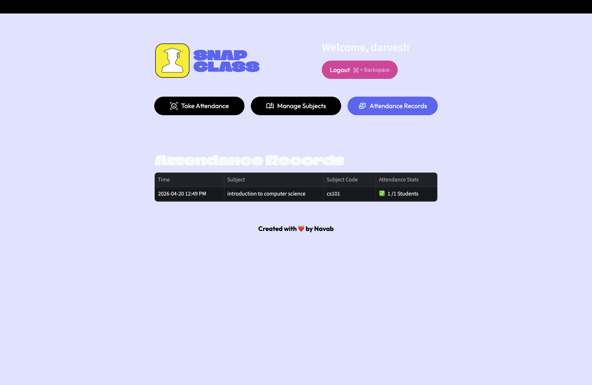
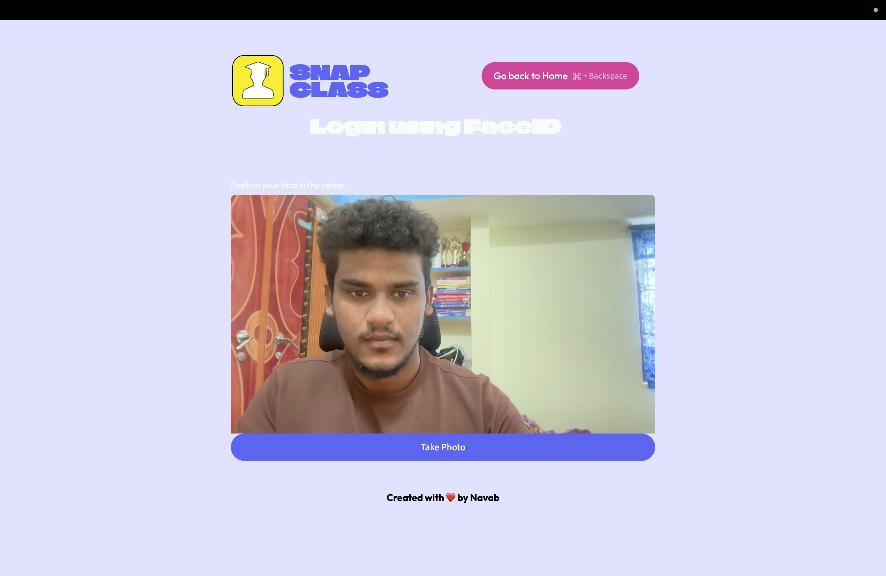
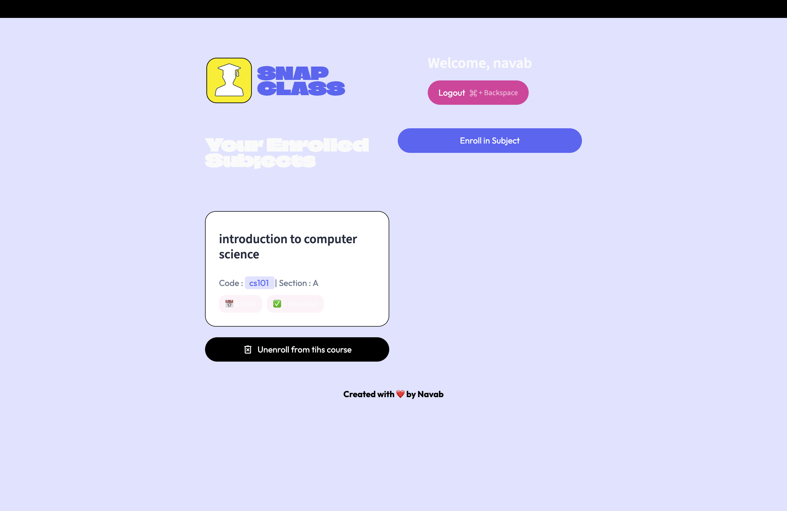

# SnapClass
### AI Powered Attendance System

  
 
 <b> Next-gen classroom automation using Face Recognition & Voice Biometrics</b> 
 
  

  

<b><u>Innovative Features</u></b>
<table> <tr> <td align="center">
📸 <b>AI Face Analysis</b>

Recognizes all students from a single photo.

</td> <td align="center">
🎙️ <b>Voice Identification</b>

Matches voice biometrics in real-time.

</td> <td align="center">
📱 <b>QR Enrollment</b>

Instant course joining via QR.

</td> </tr> </table>
    <b><u>The Teacher's Journey</u></b>
<table> <tr> <td width="50%">
🔐 Step 01 — Secure Login

Start your session securely.

</td> <td>  </td> </tr> <tr> <td>
📊 Step 02 — Dashboard

Manage subjects and attendance.

</td> <td>  </td> </tr> <tr> <td>
📚 Step 03 — Course Management

Create courses instantly.

</td> <td>  </td> </tr> <tr> <td>
📸 Step 04 — FaceID Attendance

Scan full classroom instantly.

</td> <td>  </td> </tr> <tr> <td>
🎙️ Step 05 — Voice Attendance

AI voice-based roll call.

</td> <td>  </td> </tr> <tr> <td>
📈 Step 06 — Records

Analyze and download reports.

</td> <td>  </td> </tr> </table>
<b><u>Advanced Tech Stack</u></b>

⚡ Platform	👁️ Vision AI	🎙️ Audio AI	☁️ Cloud
Streamlit + Flask	FaceRecognition + Dlib	Resemblyzer + Librosa	Supabase

🎓 <b><u>The Student's Journey</u></b>
<table> <tr> <td width="50%">
⚡ Phase 01 — Enrollment

Join via QR code instantly.

</td> <td>  </td> </tr> <tr> <td>
🧠 Phase 02 — Registration

Register Face + Voice once.

</td> <td>  </td> </tr> <tr> <td>
📊 Phase 03 — Dashboard

Track attendance in real-time.

</td> <td>  </td> </tr> </table>
🚀 Ready to upgrade your classroom?

 <b>The smartest AI attendance system is one click away.</b> 
 
  

